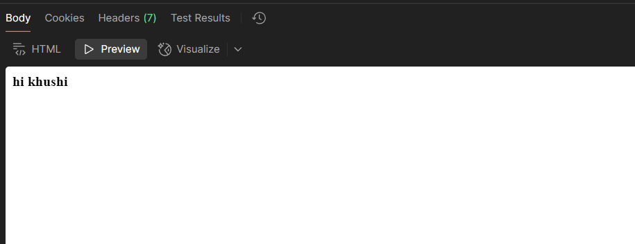
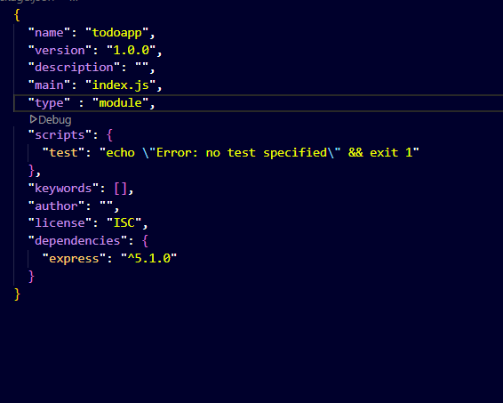

Creating My First HTTP Server in JS 🚀
Heyyy, welcome to my little experiment where I made a basic HTTP server using Node.js and Express.
Nothing fancy, just me figuring things out and trying to make things work. Here’s how I did it 👇

Steps I Followed
1. Init the Project
I started by running this in my folder terminal:
npm init -y

It created a package.json file for me (just like that 🚀).

2. Installed Express

npm install express

This dropped a whole node_modules folder and a package-lock.json (yeah, Express and all the other magic is sitting there now).

If you wanna start quickly, Express has a boilerplate right here:
https://www.npmjs.com/package/express

My Starter Code : - 
// index.js
import express from 'express';

const app = express();

app.get('/', (req, res) => {
  res.send('Hello World');
});

app.listen(3000);
Important Note:
Make sure to add this in your package.json

"type": "module"
Or else Node will yell at you with errors 😂

Why Doesn't the Process Exit?
When I ran node index.js — it just kept running, like forever.
Wanna know why? It’s because it's an HTTP Server — it keeps listening for incoming requests. It’s not something that runs and finishes — it's there, waiting, always.
(Yeah, I asked ChatGPT this 🤝)

Playing with Postman 🛠️
I also used Postman (which I just learned recently 😎) to hit this URL: - 
http://localhost:3000/
Method: GET

Boom — it showed me:

Hello World
Little Explanation: - 
app.get('/', (req, res) => {
    // req: Request data (like query params, body, etc.)
    // res: How you send back your response (text, HTML, anything)
    res.send('<b>Hi Khushi</b>');
});

